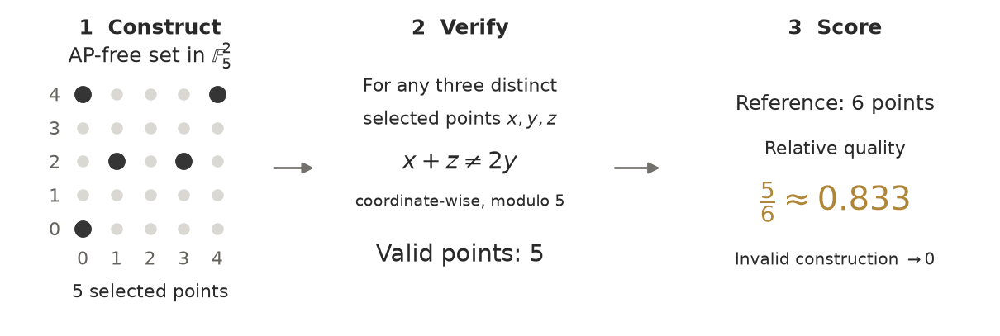
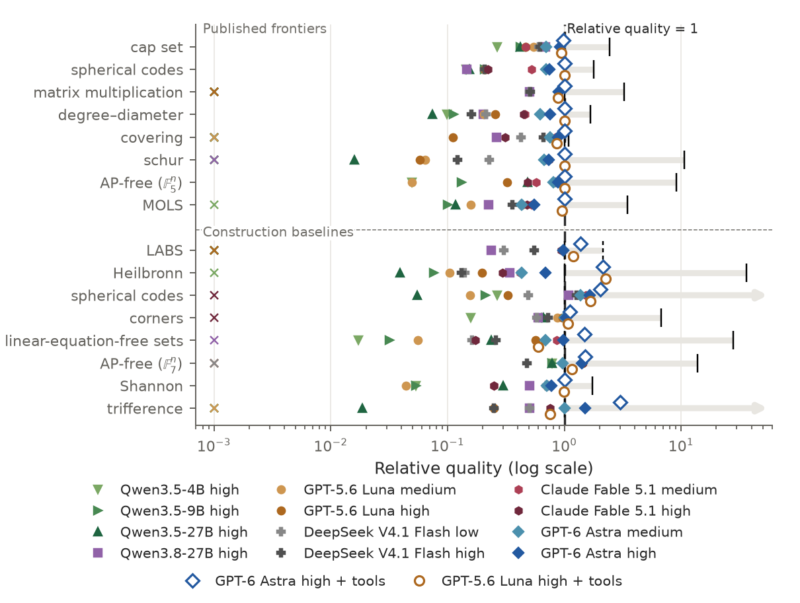

# The Endless Exam

[](https://github.com/ricolalemon/endless-exam/actions/workflows/checks.yml)

**Mathematical constructions, from today's models toward superintelligence.**

[Paper](https://arxiv.org/abs/2609.24555) · [PDF](bench/paper/endless-exam.pdf) · [Quick start](#quick-start) · [Results](bench/results/README.md) · [Evaluate a model](docs/EVALUATING.md) · [Reproduce the paper](docs/REPRODUCING.md) · [Specification](SPEC.md)

The Endless Exam is a benchmark of mathematical construction problems. A model
produces an object, a verifier checks its defining property, and the score
measures its quality relative to a published frontier or construction baseline. Better
constructions earn higher scores, including after the reference is surpassed.



## Why the Endless Exam

- **Uncapped scores.** A relative quality of 1 means parity. Ratios of 1.01, 1.5
  and 2 preserve the magnitude of successive improvements.
- **Expandable families.** Changing dimensions, degrees, diameters or code
  lengths creates further instances and extends the challenge.
- **Verifiable answers.** Scores come from mathematical properties and explicit
  objectives. Compact constructions can describe large objects through checked
  products, algebraic representations and certificates.

Version 1 samples **69 distinct instances from 14 families**, with **one response
per instance and configuration**. The paper evaluates **8 models in 12 tool-free
configurations**, plus Astra high and Luna high with code and web access.
Thirty instances use published frontiers to compare models directly with existing mathematical results. The other 39 use parameters outside published construction tables to reduce direct retrieval of ready-made answers and test adaptation of known methods; verified construction baselines provide their references.
Across the 30 published-frontier instances, every configuration has a 0%
breakthrough rate, while continuous relative quality separates tool-free models from 0.07 to 0.76
and reaches 0.998 for Astra and 0.961 for Luna with tools.

## Quick start

Python 3.10+ on macOS or Linux:

```bash
git clone https://github.com/ricolalemon/endless-exam.git
cd endless-exam
python -m venv .venv
source .venv/bin/activate
python -m pip install -r requirements.txt
```

Verify a four-point cap set locally:

```bash
python bench/exam.py verify --family capset --params '{"d":2}' --answer examples/capset.json
```

The example returns `valid: true` and `objective: 4`. Export the benchmark's
formal prompts and inspect one call:

```bash
python bench/exam.py export --output prompts.jsonl
python bench/exam.py prompt a3-capset-0
```

To evaluate a model, make one tool-free generation for each exported call, save
its answer and completion metadata as JSONL, then run:

```bash
python bench/exam.py score answers.jsonl --output scores.json
```

See [Evaluating a model](docs/EVALUATING.md) for the answer format, token budget,
failed calls and partial runs. The commands above make no model API requests.

## Results

**Score = 100 × mean relative quality over the 69 distinct instances.** Each
instance contributes one scored outcome; invalid submissions and tool-free
generation-budget exhaustion receive zero. A Score of 100 represents average
reference parity and can be exceeded.
The Published frontiers column reports mean relative quality over those 30 instances.

### Without tools

| Model | Effort | Score | Published frontiers | Valid |
|---|---|---:|---:|---:|
| GPT-6 Astra | high | 91.90 | 0.76 | 100.0% |
| GPT-6 Astra | medium | 75.34 | 0.66 | 98.6% |
| Claude Fable 5.1 | medium | 71.90 | 0.59 | 85.5% |
| DeepSeek V4.1 Flash | high | 44.90 | 0.38 | 75.4% |
| Claude Fable 5.1 | high | 43.73 | 0.54 | 52.2% |
| Qwen3.8-27B | high | 38.07 | 0.31 | 62.3% |
| DeepSeek V4.1 Flash | low | 37.11 | 0.39 | 78.3% |
| GPT-5.6 Luna | high | 34.85 | 0.25 | 68.1% |
| GPT-5.6 Luna | medium | 16.70 | 0.16 | 56.5% |
| Qwen3.5-27B | high | 16.18 | 0.13 | 52.2% |
| Qwen3.5-9B | high | 14.52 | 0.12 | 43.5% |
| Qwen3.5-4B | high | 7.55 | 0.07 | 37.7% |

All rows use the same 69-instance suite and a 128k output-token budget, including
reasoning. Full results, uncertainty intervals and the historical Opus subset
are in the paper and [machine-readable results](bench/paper/tables/publication_data.json).
The [per-instance index](bench/results/published/index.csv) lists each published outcome
and links it to the saved response, including failures.

### With code and web access

| Model | Effort | Score | Published frontiers | Valid |
|---|---|---:|---:|---:|
| GPT-6 Astra | high | 143.16 | 0.998 | 100.0% |
| GPT-5.6 Luna | high | 119.35 | 0.961 | 95.7% |

Both models receive the same mathematical prompts on all 69 instances, with four
CPU threads, 16 GiB and two hours per instance, without a cumulative output-token
cap. Astra matches 29 published frontiers and Luna 23; neither exceeds one.
They exceed 33 and 25 construction baselines, respectively. The
[tool results](bench/paper/tables/tool_publication_data.json) include all outcomes,
including Luna's two invalid answers and one memory-limit stop without an answer.



## Fourteen task families

| Family | Construct | Improve |
|---|---|---|
| Cap sets | Progression-free points over F₃ | Number of points |
| Spherical codes | Separated vectors | Number of vectors |
| Heilbronn triangles | Point configurations | Smallest triangle area |
| LABS | Binary sequences | Merit factor |
| Corner-free sets | Grid subsets avoiding corners | Set size |
| Matrix multiplication | Bilinear algorithms | Fewer scalar products |
| Degree–diameter graphs | Graphs with bounded degree and diameter | Number of vertices |
| Linear-equation-free sets | Integer sets avoiding a linear relation | Set size |
| Finite-field AP-free sets | Progression-free sets over Fq | Set size |
| MOLS | Mutually orthogonal Latin squares | Number of squares |
| Schur colourings | Sum-free colour classes | Coloured interval length |
| Covering designs | Blocks covering all required subsets | Fewer blocks |
| Shannon codes | Distinguishable codewords | Number of codewords |
| Trifference codes | Codes separating every triple | Number of codewords |

Spherical codes and Heilbronn each have two task variants. The code also retains
supplementary controls. The [specification](SPEC.md) defines the formal suite
and scoring, and the paper appendix gives illustrated examples and parameters.

## Repository guide

| Path | Contents |
|---|---|
| `bench/exam.py` | Public prompt export, verification and scoring CLI |
| `bench/openceiling.py` | Families, construction formats and primary verifiers |
| `bench/candidate_families.py` | Shannon and trifference implementations |
| `bench/crosscheck.py` | Independent checks |
| `bench/refs/`, `bench/frontiers/` | Frozen reference constructions and scoring values |
| `bench/data/reference_witnesses/` | Verified constructions attaining all 69 reference values |
| `bench/results/` | Released final responses and evaluation metadata |
| `bench/results/published/index.csv` | The 966 main-evaluation outcomes and their source records |
| `bench/paper/` | Paper, figures, tables and reproduction scripts |
| `examples/` | Small runnable construction examples |

## Reproduce and contribute

[Reproduction instructions](docs/REPRODUCING.md) cover scores, figures and the
paper build. [Contributing](CONTRIBUTING.md) explains verifier changes, new
constructions and model submissions. Report bugs or proposed records through
[GitHub Issues](https://github.com/ricolalemon/endless-exam/issues).
The [data guide](docs/DATA.md) explains the result index, response selection and
reference evidence.

## Citation

```bibtex
@misc{zhang2026endless,
  author = {Muhan Zhang},
  title = {The Endless Exam: Mathematical Constructions from Today's Models toward Superintelligence},
  year = {2026},
  eprint = {2609.24555},
  archivePrefix = {arXiv},
  primaryClass = {cs.AI},
  doi = {10.48550/arXiv.2609.24555},
  url = {https://arxiv.org/abs/2609.24555}
}
```

## License

Original code and documentation are released under the [MIT license](LICENSE).
See [third-party notices](THIRD_PARTY_NOTICES.md) for reference data, model
responses and paper templates.
